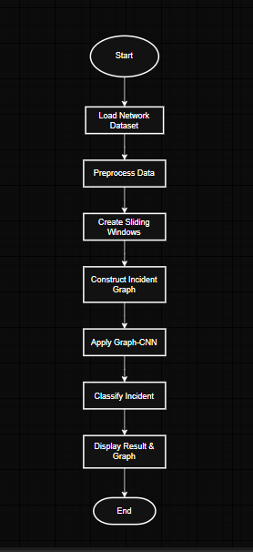
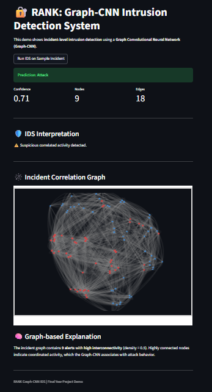

# 🔐 RANK: Graph-Based Intrusion Detection using Graph-CNN

🚀 A Graph Neural Network (GNN) based Intrusion Detection System that models network traffic as graphs and detects coordinated cyber-attacks using Graph Convolutional Networks (Graph-CNN).

---

## 📌 Project Overview

Traditional Intrusion Detection Systems (IDS) analyze network traffic as independent records, often missing correlated attack patterns.

This project introduces a **Graph-Based Intrusion Detection System (RANK)** that:
- Represents network alerts as **graphs**
- Captures relationships between alerts (IP, port, time)
- Uses **Graph Convolutional Networks (GCN)** for classification
- Detects **coordinated attacks at incident level**

---

## 🎯 Key Features

- ✅ Graph-based anomaly detection
- ✅ Incident-level attack classification (not just row-wise)
- ✅ Interactive Streamlit dashboard
- ✅ Real-time API-based prediction (FastAPI)
- ✅ Graph visualization of network behavior
- ✅ Attack vs Normal classification
- ✅ Attack type interpretation (DoS, Exploits, etc.)

---

## 🧠 How It Works

### Pipeline:

1. Load network dataset (UNSW-NB15 / DARPA)
2. Preprocess data (cleaning, encoding)
3. Create sliding windows (incident grouping)
4. Construct graph:
   - Nodes → Alerts
   - Edges → Shared IP / Port / Time
5. Apply Graph-CNN model
6. Predict:
   - Attack / Normal
   - Confidence score
7. Visualize graph + explanation in dashboard

---

## 🏗️ System Architecture

---

## 🔄 Workflow

---

## 🕸️ Graph Representation

---

## 📊 Dashboard Output

---

## 🛠️ Tech Stack

| Category        | Technology |
|----------------|-----------|
| Programming    | Python |
| ML Framework   | PyTorch |
| Graph ML       | PyTorch Geometric |
| Backend API    | FastAPI |
| Frontend       | Streamlit |
| Visualization  | PyVis |
| Data Handling  | Pandas, NumPy |

---

## 📂 Project Structure
